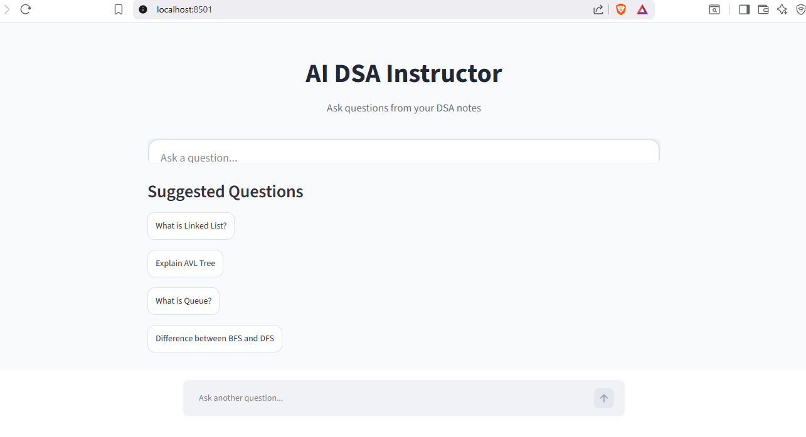
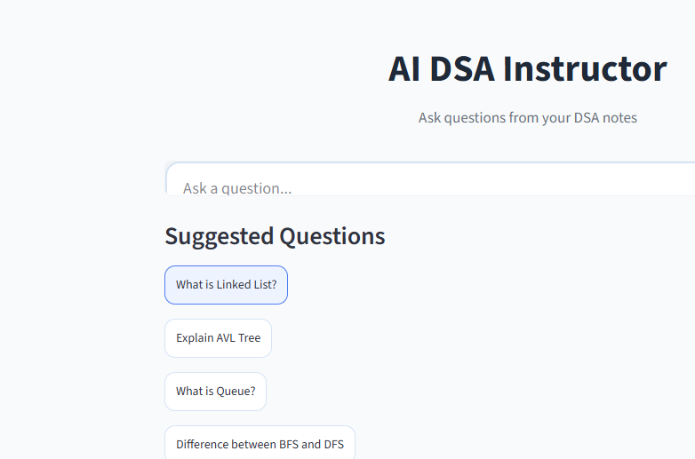

# AI DSA Instructor 

An AI-powered Data Structures and Algorithms (DSA) learning assistant built using **Retrieval-Augmented Generation (RAG)**. The application allows users to upload DSA notes in PDF format and ask questions in natural language. It retrieves the most relevant content from the uploaded notes using semantic search and generates accurate, context-aware answers using Google's Gemini model.

---

## Features

*  Upload DSA notes in PDF format
*  Semantic search using FAISS vector database
*  AI-powered question answering with Gemini
*  Retrieval-Augmented Generation (RAG) pipeline
*  Fast and relevant responses
*  Interactive Streamlit web interface

---

##  Tech Stack

* **Python**
* **Streamlit**
* **LangChain**
* **Google Gemini API**
* **FAISS**
* **PyPDF**
* **python-dotenv**

---

##  Project Structure

```text
AI_DSA_Instructor/
│── Images/
│   ├── ui.png
│   ├── image.png
│   └── output display.jpeg
│
│── data/
│   └── dsa_notes.pdf
│
│── app.py
│── rag.py
│── ingest.py
│── vector_store.py
│── chunking.py
│── test_api.py
│── README.md
│── .gitignore
```

---

##  How It Works

1. Upload a DSA PDF.
2. The PDF is split into smaller text chunks.
3. Embeddings are generated for each chunk.
4. FAISS stores the embeddings for efficient similarity search.
5. When a user asks a question, the most relevant chunks are retrieved.
6. Gemini uses the retrieved context to generate an accurate answer.
7. The answer is displayed through the Streamlit interface.

---

##  Screenshots

### User Interface



### UI



### AI Response


---

##  Installation

Clone the repository:

```bash
git clone https://github.com/smilinnggg/AI_DSA_Instructor.git
cd AI_DSA_Instructor
```

Install the required packages:

```bash
pip install -r requirements.txt
```

Create a `.env` file:

```env
GOOGLE_API_KEY=YOUR_API_KEY
```

Generate the vector database:

```bash
python ingest.py
```

Run the application:

```bash
streamlit run app.py
```

---

##  Future Improvements

* Support multiple PDFs
* Conversation history
* Voice-based questions
* Topic-wise filtering
* Better retrieval with reranking
* Support for additional AI models

---

##  Learning Outcomes

This project helped in understanding:

* Retrieval-Augmented Generation (RAG)
* LangChain workflows
* Vector embeddings
* FAISS vector search
* Prompt engineering
* Streamlit application development
* Integration of Large Language Models (LLMs)

---

##  Author

**Gayatri Rokade**
BE Computer
Sinhgad College of Engineering


